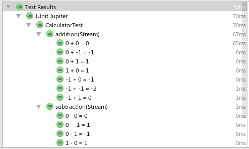

JUnit 5 introduced parameters for test methods.
In order for the parameters to work, a `ParameterResolver` has to be provided.
If any test method parameter can't be resolved, the tests will not be executed at all.

**Example:**
```java

@Test
void testSomething(TestInfo info){
    ...
}

```
`TestInfo` is a class provided by JUnit 5. It contains all kinds of information
about the current test.

## Parameter Resolver Extension Point

Writing your own `ParameterResolver` is pretty straight forward.
You simply create a class which extends the `ParameterResolver` interface and
use it in your tests like you would any other extension:
`@ExtendWith(MyParameterResolver.class)` on either a class, constructor or test method.

Now I will show you how to create your own `ParameterResolver`.
For this, I will build on my previous post about [Dynamic Tests](http://blog.novatec-gmbh.de/dynamic-tests-junit-5/).

The original test methods looked like this:
```java
@TestFactory
Stream<DynamicTest> addition() {
    return DataSet.parseRuleFile("addition-rules.txt")
        .map(dataSet -> dynamicTest(getAdditionDisplayName(dataSet), () -> {
            int result = cut.add(dataSet.getValueA(), dataSet.getValueB());
            assertThat(result).isEqualTo(dataSet.getExpectedResult());
        }));
}

@TestFactory
Stream<DynamicTest> subtraction() {
    return DataSet.parseRuleFile("subtraction-rules.txt")
        .map(dataSet -> dynamicTest(getSubtractionDisplayName(dataSet), () -> {
            int result = cut.subtract(dataSet.getValueA(), dataSet.getValueB());
            assertThat(result).isEqualTo(dataSet.getExpectedResult());
        }));
}

```

Now we want them to look like this:

```java
@TestFactory
@RulesFile("addition-rules.txt")
Stream<DynamicTest> addition(Stream<DataSet> dataSets) {
    return dataSets.map(dataSet -> dynamicTest(getAdditionDisplayName(dataSet), () -> {
        int result = cut.add(dataSet.getValueA(), dataSet.getValueB());
        assertThat(result).isEqualTo(dataSet.getExpectedResult());
    }));
}

@TestFactory
@RulesFile("subtraction-rules.txt")
Stream<DynamicTest> subtraction(Stream<DataSet> dataSets) {
    return dataSets.map(dataSet -> dynamicTest(getSubtractionDisplayName(dataSet), () -> {
            int result = cut.subtract(dataSet.getValueA(), dataSet.getValueB());
            assertThat(result).isEqualTo(dataSet.getExpectedResult());
        }));
}
```

With this new version of the Tests, we:

- define the rules file via the `@RulesFile` annotation
- get our test data from the parameter

Dynamic tests are of course not the only place where `ParameterResolver` can be used.
Other places include:

- Constructors
- Test Methods
- BeforeAll
- BeforeEach
- AfterEach
- AfterAll
- etc.

So, what does the actual `ParameterResolver` look like?
```java
public class DataSetResolver implements ParameterResolver {

    @Override
    public boolean supports(ParameterContext parameterContext, ExtensionContext extensionContext) {
        Parameter parameter = parameterContext.getParameter();
        Class<?> type = parameter.getType();
        if (Stream.class.equals(type)) {
            ParameterizedType parameterizedType = ( ParameterizedType ) parameter.getParameterizedType();
            Type firstGenericArgument = parameterizedType.getActualTypeArguments()[0];
            return DataSet.class.equals(firstGenericArgument);
        }
        return false;
    }

    @Override
    public Object resolve(ParameterContext parameterContext, ExtensionContext extensionContext) {
        Executable executable = parameterContext.getDeclaringExecutable();
        RulesFile annotation = executable.getAnnotation(RulesFile.class);
        if (annotation != null) {
            String fileName = annotation.value();
            return DataSet.parseRuleFile(fileName);
        }
        throw new IllegalStateException("Missing @RulesFile annotation on " + executable);
    }

}
```

`ParameterResolver` consist of two methods:

1. `public boolean supports(ParameterContext parameterContext, ExtensionContext extensionContext)`
This method will be invoked for all the parameters within your test class.
If it returns `true` the parameter will be resolved using the second method.
In this case, we only return true for a `Stream<DataSet>`, but a single resolver could also handle multiple types of parameters.
2. `public Object resolve(ParameterContext parameterContext, ExtensionContext extensionContext)`
This is the actual resolver for the parameter. It evaluates the `@RulesFile` annotation of the test method in order to get the name of the file to use. The file is loaded the same way it was in the previous implementation and its contents returned as a `Stream<DataSet>`.

## The Result

When the new tests are executed, the result is the same as earlier:



As you can see, JUnit generated the same tests as before, but this time the input is not loaded with the test.